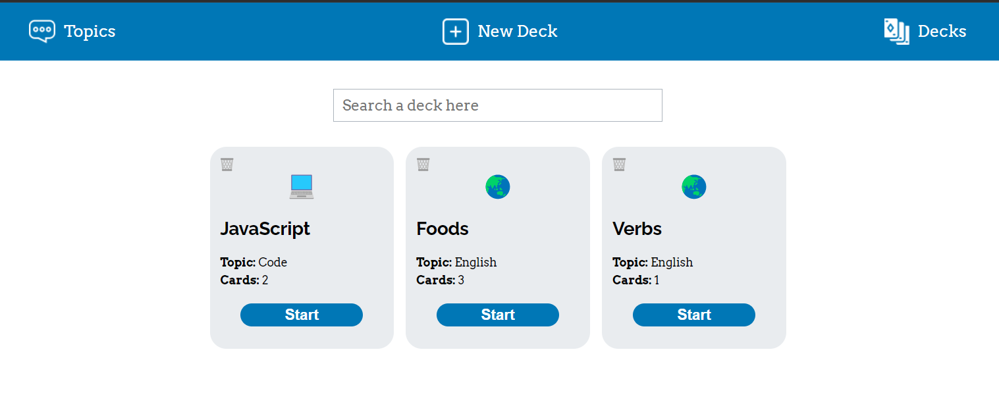

# Flashcard App

An app that allows users create decks and play with them to see how much they can remember of a deck.

## Table of contents
- [General info](#general-info)
- [Objective](#objective)
- [Technologies](#technologies)
- [Setup](#setup)

## General info

The app has four main features:
- Create a new topic
- Create a new deck
- See the current decks and delete them
- Play with the decks

The user can create a deck, with how many cards he wishes, of a certain topic. This topic can also be created by the user. The user can play with the deck too to see how many cards he remembers. At the end of a game, the app shows a report based on the feedback of the user throught the game.

## Objective

Put in practice the concepts that I've learnt about React, Redux, JavaScript, and web app hosting.

## Technologies

- CSS
- HTML
- JavaScript
- React
- Redux
- Github
- Git
- Netlify

## Setup

To view the project, click [here](https://pam-flashcard-app.netlify.app/).

